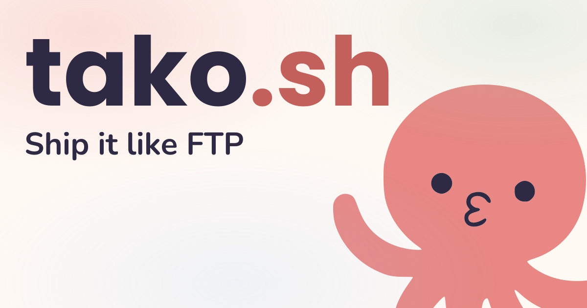

# Tako



[](https://www.npmjs.com/package/tako.sh)
[](https://crates.io/crates/tako)
[](https://crates.io/crates/tako-server)

Tako helps you ship apps to your own servers without turning deployment
into a part-time job.

## Why Tako exists

Deploying used to feel simple: upload files, refresh, done.

Tako is an attempt to bring that feeling back, but with modern guardrails:

- fast local development
- smooth deploy flow
- app up and serving traffic quickly, without platform drama

You get:

- a CLI (`tako`) for local dev + deployment
- a remote runtime/proxy (`tako-server`)
- a local development daemon (`tako-dev-server`)
- a JavaScript/TypeScript SDK (`tako.sh`)

## Prerequisites

- Rust toolchain (stable)
- Bun (for SDK/examples/website tooling)
- `just` (optional, but useful for repo tasks)

## Quickstart

From the repo root:

```bash
bun install
git config core.hooksPath .githooks
cargo build
cargo test --workspace
# Full matrix: Rust workspace + SDK tests + Docker e2e fixture test
just test
```

Run CLI help from source:

```bash
cargo run -p tako --bin tako -- --help
```

Run the Bun example with Tako local dev flow:

```bash
just tako examples/js/bun dev
```

Format Rust + repo files:

```bash
just fmt
```

Run lint checks:

```bash
just lint
```

Run full local CI flow (format, lint, tests):

```bash
just ci
```

## Repo Layout

- `tako/`: CLI crate (`tako`) and local dev daemon binary (`tako-dev-server`)
- `tako-server/`: remote runtime/proxy crate (`tako-server`)
- `tako-core/`: shared protocol types
- `tako-socket/`: shared Unix socket JSONL transport helpers
- `sdk/`: `tako.sh` SDK package
- `examples/`: runnable examples
- `e2e/`: deploy e2e fixture apps used by Docker integration tests
- `scripts/`: install/check helper scripts
- `website/`: Tako website + installer endpoints
- `docker/`: internal Docker tooling for build/debug workflows

## Deploy E2E Fixture Test

Run Docker-based deploy e2e for fixture apps:

```bash
just e2e e2e/fixtures/js/bun
just e2e e2e/fixtures/js/tanstack-start
```

## Docs

User docs live in `website/` (source pages: `website/src/pages/docs/`).

Component-focused docs:

- `tako/README.md`
- `tako-server/README.md`
- `tako-core/README.md`
- `tako-socket/README.md`
- `sdk/README.md`

## License

MIT
