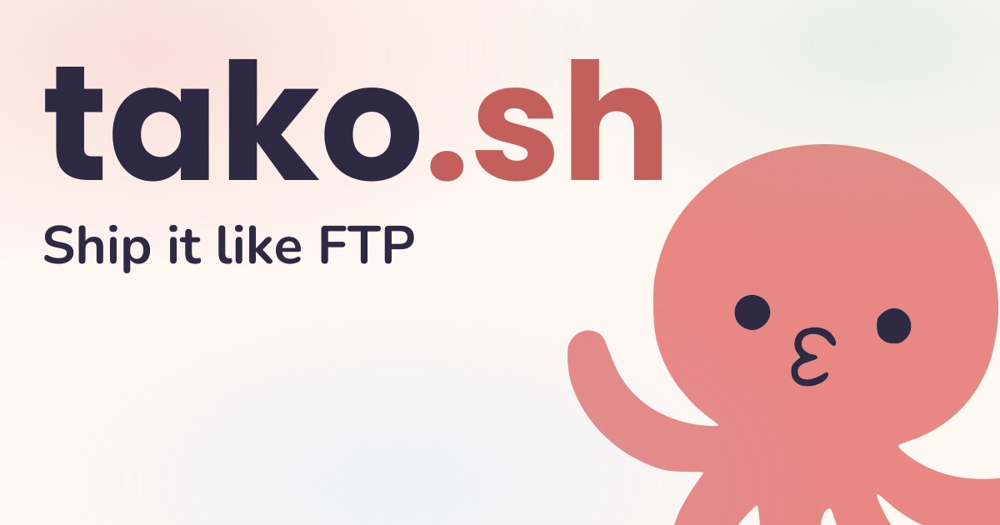

# Tako



[](https://www.npmjs.com/package/tako.sh)

Ship apps to your own servers without turning deployment into a part-time job.

Tako gives you the "upload files, refresh, done" feeling with modern guardrails — rolling deploys, load balancing, HTTPS, secrets, and logs out of the box.

## Install the CLI

```bash
curl -fsSL https://tako.sh/install.sh | sh
```

Verify:

```bash
tako --version
```

## Local development

From your app directory, install the SDK and start developing:

```bash
bun add tako.sh   # or: npm install tako.sh
tako dev
```

For JS projects, Tako runs your runtime lane's `dev` and `build` scripts by default. If you use Vite+, Turborepo, or another workspace tool, put it behind those scripts.

App-scoped commands default to `./tako.toml`. Use `-c/--config <CONFIG>` to target another config file; Tako treats that path's parent directory as the project context, and omitting the `.toml` suffix is supported and recommended for brevity.

On first run, Tako sets up local HTTPS with a trusted certificate (asks for `sudo` once). Open the URL shown in the terminal — by default `{app}.tako`.

## Deploy

### Set up your server

On each deployment host, install the runtime:

```bash
sudo sh -c "$(curl -fsSL https://tako.sh/install-server.sh)"
```

Then add the server from your local machine:

```bash
tako servers add <host-or-ip>
```

### Ship it

From your app directory:

```bash
tako init    # prompts for app name + production route, writes tako.toml, updates .gitignore for .tako/secrets.json
tako deploy
```

That's it. Your app is live.

## Documentation

Full docs at [tako.sh/docs](https://tako.sh/docs):

- [Quickstart](https://tako.sh/docs/quickstart) — install to live in minutes
- [How Tako Works](https://tako.sh/docs/how-tako-works) — architecture and mental model
- [tako.toml Reference](https://tako.sh/docs/tako-toml) — every config option
- [CLI Reference](https://tako.sh/docs/cli) — all commands and flags
- [Framework Guides](https://tako.sh/docs/framework-guides) — adapter examples
- [Local Development](https://tako.sh/docs/development) — HTTPS, DNS, environment variables
- [Deployment](https://tako.sh/docs/deployment) — deploy flow, rolling updates, rollbacks
- [Troubleshooting](https://tako.sh/docs/troubleshooting) — common issues and fixes

## Contributing

<details>
<summary>Development setup</summary>

### Prerequisites

- Rust toolchain (stable)
- Bun (for SDK/examples/website tooling)
- `just` (optional, but useful for repo tasks)

### Build and test

```bash
bun install
git config core.hooksPath .githooks
cargo build
cargo test --workspace
just test   # full matrix: Rust + SDK + Docker e2e
```

### Common commands

```bash
just fmt    # format Rust + repo files
just lint   # run lint checks
just ci     # full local CI flow (format, lint, tests)
```

### Repo layout

- `tako/` — CLI + local dev daemon
- `tako-server/` — remote runtime/proxy
- `tako-core/` — shared protocol types
- `tako-socket/` — shared Unix socket transport
- `sdk/javascript/` — `tako.sh` SDK package
- `examples/` — runnable examples
- `e2e/` — Docker-based deploy e2e fixtures
- `website/` — docs site + installer endpoints

</details>

## License

MIT — see [LICENSE](LICENSE).
